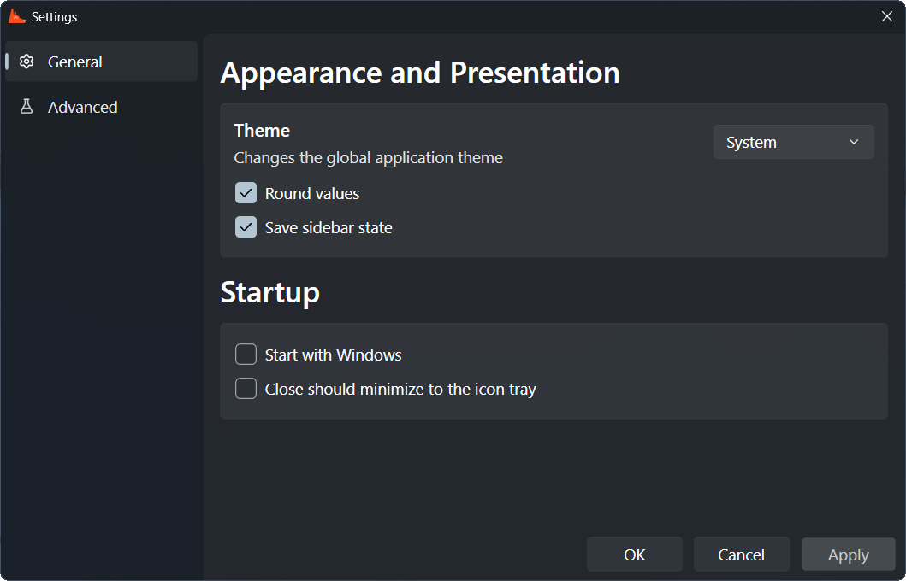
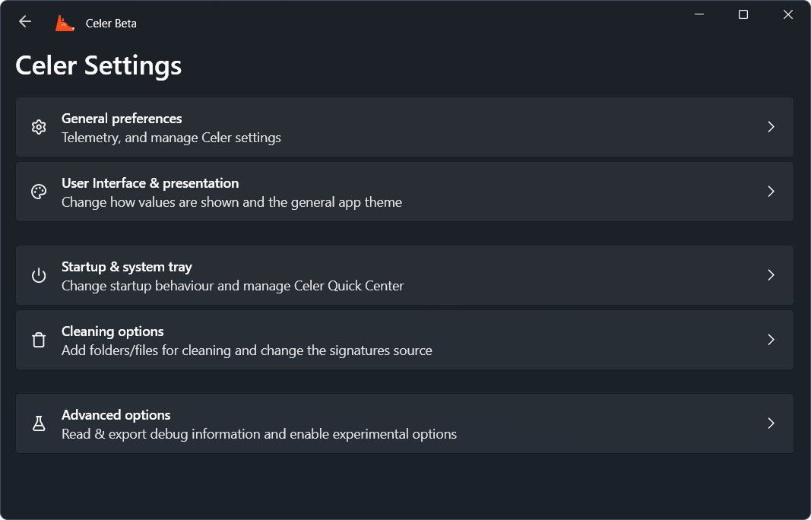

Back in 27, April 2026 I've made an announcement on our social media regarding the state of Celer and that I would be archiving the project on the same day, fast-forward some weeks to 15, May 2026, and you'll notice that the Celer repo on GitHub is not archived anymore because I've made the decission to restart development on the project.

Now some of the decisions behind archiving Celer were caused by many factors, the main two being:

- **Tech debt and general issues with WPF**

  WPF is an ancient framework for building graphical applications for Windows. It is pretty advanced and works great most of the time however it does come with some issues caused mainly by its age and slower development.

  Since I started redesigning most of the user controls to support scrolling, I've noticed scroll would not work depending on the element the mouse was hovering, even if the parent did have a scrollviewer enabled.

  There's also general issues with rendering, but it's mainly caused by Intel Arc using a translation layer to render DX9 calls under DX12 since Intel Arc does not support DX9 direclty which WPF uses.

- **Disinterest and tiredness of Windows**

  This is more of a personal aspect, Celer being a Windows-only project that means it's development happens under Windows. However I've started to see (and many other people too) the platform start to crumble apart, I'm obviously talking about the bloat, AI integration, and performance degradation, these all make the OS unpleasant to use and in turn takes motivation out of me to continue with Celer's development.

  There's also another big issue that not many people don't talk about, the development experience on Windows is poor, mainly because of performance but also because Windows is not close to Unix like MacOS or Linux are, Windows has a lot of limiations caused by it's old base. WSL exists but it's not the perfect solution because the OS itself is still the same. All of this to say that I've moved on from Windows but I will still be developing Celer although at a slower rate.

The reason for this post is to tell everyone Celer is coming back and to show what are the current plans for the project, from a first stable release to upcoming major features.

## Improving Modularity

Before Celer got archived, I wes working on making Celer more modular through the creation of a [new package](https://github.com/surfscape/celer/tree/main/Infrastructure) called `Infrastructure`, this package would contain various classes that abstracts the system (both hardware like display, battery, sensors, to software like services, security, other applications, and more).

I only got far into making one for the battery, this class contains centralized methods and properties that allows someone to retrieve information of the system's battery, both static data (ex: brand, model, and factory full capacity) and dynamic data (health, charge, remaining time, and more).

Celer currently has this scattered, some code resides in the Power Module view model, another part in the class for power management, and the rest in the battery class. With this new package not only everything is in one place, it's also way easier to implement and document.

## New Settings Window

The current settings window works, but it's pretty cumbersome to add new preferences, not only that, it's also built in a way where the user needs to apply their changes manually instead of the app handling it.

<figure>

<figcaption>Old Celer settings window</figcaption>
</figure>

It would be nicer to have something that is more organized, easier to use, easier to add new preferences to, and that notifies the user (ex: when a user changed something that requires an app restart) and provide more useful information (by using tooltips for example).

Although development has started on this, it's far from ready, but it's looking much nicer that the older window!

<figure>

<figcaption>New Celer settings window</figcaption>
</figure>

## Design Changes

Another major change that is currently in progress is the design, Celer already looks pretty good and matches with the Windows 11 Fluent Design system but there are still some inconsistencies mainly do to some of the elements being hard-coded, as in, most are not reusable components so there is a lot of overlap between elements but none of their code is reused making some parts of the app similar but not consistent and also being more cumbersome to modify.

Making most of these elements into reusable components also means these will suffer some aspect changes to make them more adaptable.
